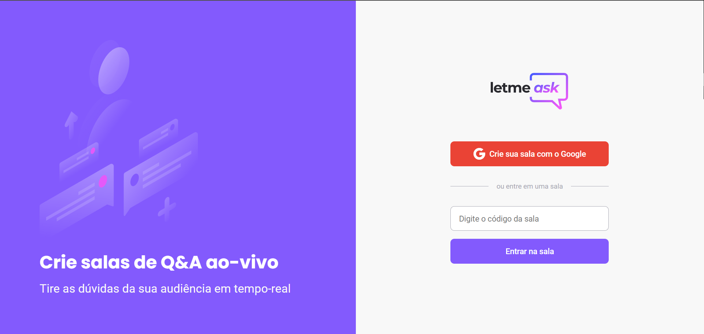
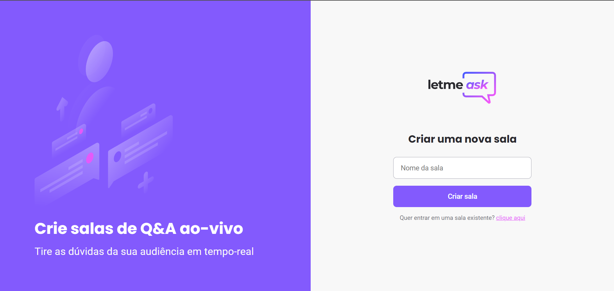
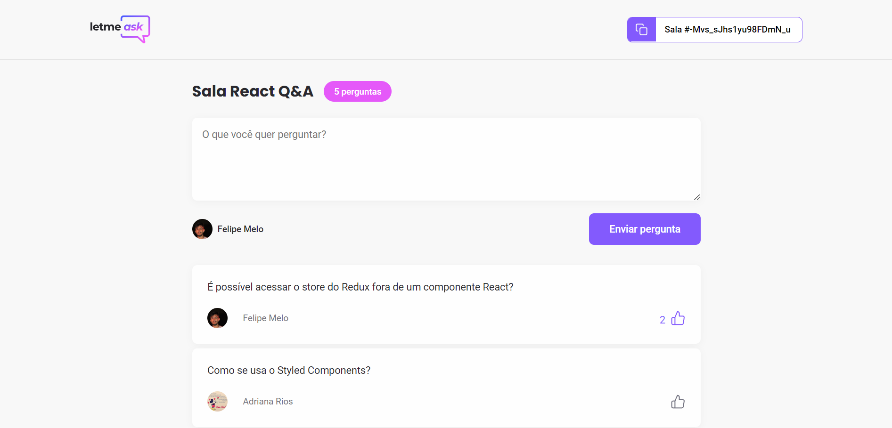
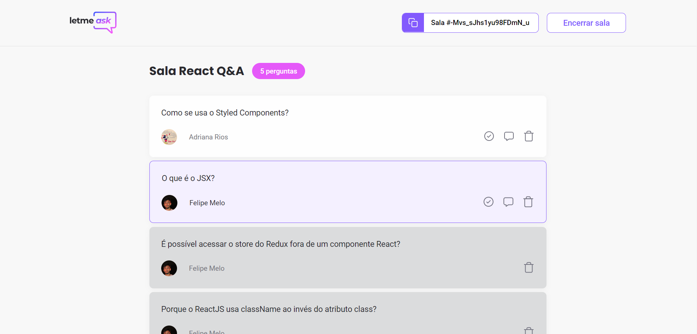

<h1 align="center">
  
</h1>

<p align="center">
  <a href="#-tecnologias">Tecnologias</a>&nbsp;&nbsp;&nbsp;|&nbsp;&nbsp;&nbsp;
  <a href="#-comoexecutar">Como executar</a>&nbsp;&nbsp;&nbsp;|&nbsp;&nbsp;&nbsp;
  <a href="#-projeto">Projeto</a>&nbsp;&nbsp;&nbsp;|&nbsp;&nbsp;&nbsp;
  <a href="#-screenshots">Screenshots</a>&nbsp;&nbsp;&nbsp;|&nbsp;&nbsp;&nbsp;
  <a href="#-layout">Layout</a>&nbsp;&nbsp;&nbsp;|&nbsp;&nbsp;&nbsp;
  <a href="#memo-licença">Licença</a>
</p>

<p align="center">
  
</p>

## 🧪 Tecnologias

Esse projeto foi desenvolvido com as seguintes tecnologias:

- Typescript
- SASS
- React
- React Hooks
- Context API
- Firebase

## 🚀 Como executar

Há duas formar de executar a aplicação:

1. Executar a aplicação localmente: 

Clone o projeto e acesse a pasta do mesmo.

```bash
$ git clone https://github.com/felipefrm/letmeask
$ cd letmeask
```

Para iniciá-lo, siga os passos abaixo:
```bash
# Instalar as dependências
$ npm install

# Iniciar o projeto
$ npm start
```
O app estará disponível no seu browser pelo endereço http://localhost:3000.

Lembrando que será necessário criar uma conta no [Firebase](https://firebase.google.com/) e um projeto para disponibilizar um Realtime Database.

2. Executar a aplicação hospedada no Firebase, acessando o seguinte link: https://letmeask-d1ec4.web.app. 

## 💬 Projeto

Letmeask é perfeito para criadores de conteúdos poderem criar salas de Q&A com o seu público, de uma forma muito organizada e democrática.

Este é um projeto desenvolvido durante a Next Level Week Together, apresentada dos dias 20 a 27 de Junho de 2021.

## 💻 Screenshots

- Tela inicial


- Criar sala


- Dentro de uma sala (visão do usuário)


- Dentro de uma sala (visão do criador da sala)


## 🔖 Layout

Você pode visualizar o layout do projeto através do seguinte [link](https://www.figma.com/community/file/1009824839797878169/Letmeask). 

Lembrando que você precisa ter uma conta no [Figma](http://figma.com/).

## :memo: Licença

Esse projeto está sob a licença MIT. Veja o arquivo [LICENSE](.github/LICENSE.md) para mais detalhes.

---

<p align=center>Feito por <a href="https://www.linkedin.com/in/felipefrmelo/">Felipe Melo<a> :wave:</p>